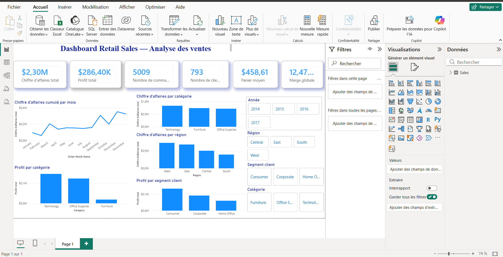

# Retail Sales Analysis

## 1. Présentation du projet

Ce projet a pour objectif d’analyser les ventes d’un magasin retail à partir du dataset **Sample Superstore**.

L’analyse vise à comprendre les performances commerciales de l’entreprise à travers plusieurs axes :

- le chiffre d’affaires ;
- le profit ;
- les produits les plus performants ;
- les catégories les plus rentables ;
- les périodes de forte activité ;
- les segments clients ;
- les régions les plus performantes.

Le projet combine une analyse exploratoire avec Python et la création d’un dashboard interactif avec Power BI.

---

## 2. Objectif métier

L’objectif principal est de répondre à la problématique suivante :

> Comment analyser les ventes d’un magasin retail afin d’identifier les produits, catégories, périodes, clients et régions les plus rentables ?

Ce projet permet de montrer comment la data peut aider une entreprise à mieux piloter son activité commerciale et à prendre des décisions orientées rentabilité.

---

## 3. Questions business

Les principales questions traitées dans ce projet sont :

1. Quels produits génèrent le plus de chiffre d’affaires ?
2. Quels produits sont les plus vendus en quantité ?
3. Quels mois sont les plus performants ?
4. Quelles catégories génèrent le plus de chiffre d’affaires et de profit ?
5. Pourquoi certaines catégories sont-elles moins rentables ?
6. Quels segments clients rapportent le plus ?
7. Quels clients sont les plus rentables ?
8. Quelles régions sont les plus performantes ?
9. Quelles recommandations business peut-on proposer à partir des données ?

---

## 4. Dataset utilisé

Le dataset utilisé est **Sample Superstore**, un jeu de données classique pour les projets Data Analyst.

Il contient des informations sur :

- les commandes ;
- les clients ;
- les produits ;
- les catégories ;
- les régions ;
- les ventes ;
- les quantités ;
- les remises ;
- les profits.

### Colonnes principales

| Colonne | Description |
|---|---|
| `Order ID` | Identifiant de commande |
| `Order Date` | Date de commande |
| `Customer ID` | Identifiant client |
| `Customer Name` | Nom du client |
| `Segment` | Segment client |
| `Region` | Région |
| `Category` | Catégorie produit |
| `Sub-Category` | Sous-catégorie produit |
| `Product Name` | Nom du produit |
| `Sales` | Chiffre d’affaires |
| `Quantity` | Quantité vendue |
| `Discount` | Remise appliquée |
| `Profit` | Profit généré |

---

## 5. Outils utilisés

- Python
- Pandas
- Matplotlib
- Jupyter Notebook
- Power BI
- Power Query
- DAX
- VS Code

---

## 6. Structure du projet

```text
retail-sales-analysis/
│
├── data/
│   ├── retail_sales_raw.csv
│   └── retail_sales_clean.csv
│
├── notebooks/
│   └── 01_exploration_ventes.ipynb
│
├── outputs/
│   ├── figures/
│   │   ├── sales_by_month.png
│   │   ├── sales_by_year.png
│   │   ├── sales_by_region.png
│   │   ├── sales_by_category.png
│   │   ├── profit_by_segment.png
│   │   └── ...
│   │
│   └── results/
│       ├── kpis_summary.csv
│       ├── category_performance.csv
│       ├── region_performance.csv
│       ├── segment_performance.csv
│       └── ...
│
├── dashboard/
│   └── retail_sales_dashboard.pbix
│
├── requirements.txt
└── README.md
```

---

## 7. Étapes du projet

### 7.1 Chargement des données

Les données ont été importées avec Pandas depuis un fichier CSV.

Un problème d’encodage a été rencontré lors de l’import initial. Il a été corrigé en utilisant l’encodage `latin1`.

```python
df = pd.read_csv("../data/retail_sales_raw.csv", encoding="latin1")
```

---

### 7.2 Exploration des données

L’exploration initiale a permis d’identifier :

- 9 994 lignes ;
- 21 colonnes ;
- 5 009 commandes uniques ;
- 793 clients uniques ;
- 1 862 produits uniques.

Une ligne représente un produit vendu dans une commande, et non une commande complète.  
C’est pourquoi le nombre de commandes a été calculé avec `nunique()` sur la colonne `Order ID`.

---

### 7.3 Nettoyage et préparation

Les principales étapes de préparation ont été :

- conversion des colonnes `Order Date` et `Ship Date` au format date ;
- création de colonnes temporelles :
  - `Order Year` ;
  - `Order Month` ;
  - `Order Month Name` ;
  - `Order Quarter` ;
  - `Order Year-Month` ;
- export d’un fichier nettoyé : `retail_sales_clean.csv`.

---

### 7.4 Analyse exploratoire

Plusieurs analyses ont été réalisées :

- analyse des KPI globaux ;
- analyse des produits ;
- analyse temporelle ;
- analyse des catégories ;
- analyse des sous-catégories ;
- analyse des remises ;
- analyse des segments clients ;
- analyse des meilleurs clients ;
- analyse géographique.

---

### 7.5 Dashboard Power BI

Un dashboard interactif a été réalisé avec Power BI.

Il contient :

- des cartes KPI ;
- une analyse mensuelle du chiffre d’affaires ;
- une analyse par catégorie ;
- une analyse par région ;
- une analyse par segment client ;
- des filtres interactifs :
  - année ;
  - région ;
  - segment client ;
  - catégorie.

---

## 8. KPIs principaux

| KPI | Valeur |
|---|---:|
| Chiffre d’affaires total | 2,30 M$ |
| Profit total | 286,40 K$ |
| Nombre de commandes | 5 009 |
| Nombre de clients | 793 |
| Panier moyen | 458,61 $ |
| Marge globale | 12,47 % |
| Quantité totale vendue | 37 873 |

---

## 9. Principaux résultats

### 9.1 Produits

Les produits qui génèrent le plus de chiffre d’affaires sont principalement des équipements à forte valeur unitaire, comme les copieurs, imprimantes et systèmes de visioconférence.

À l’inverse, les produits les plus vendus en quantité sont surtout des fournitures de bureau comme les agrafes, enveloppes et papiers.

Cela montre qu’un produit très vendu en volume n’est pas nécessairement celui qui génère le plus de chiffre d’affaires.

---

### 9.2 Analyse temporelle

Les ventes progressent globalement sur la période étudiée.

L’année 2017 est la plus performante.

Les mois les plus forts sont :

- novembre ;
- décembre ;
- septembre.

Le mois de février est le moins performant.

---

### 9.3 Catégories

La catégorie `Technology` est la plus performante en chiffre d’affaires et en profit.

La catégorie `Furniture` génère un chiffre d’affaires important, mais sa rentabilité est faible.

La catégorie `Office Supplies` génère un chiffre d’affaires légèrement inférieur à `Furniture`, mais un profit nettement supérieur.

---

### 9.4 Sous-catégories Furniture

La faible rentabilité de `Furniture` est principalement liée à deux sous-catégories :

- `Tables` ;
- `Bookcases`.

Ces deux sous-catégories sont déficitaires.

| Sous-catégorie | Profit | Marge |
|---|---:|---:|
| `Tables` | -17 725,48 $ | -8,56 % |
| `Bookcases` | -3 472,56 $ | -3,02 % |
| `Furnishings` | 13 059,14 $ | 14,24 % |
| `Chairs` | 26 590,17 $ | 8,10 % |

---

### 9.5 Remises

Les sous-catégories déficitaires sont aussi celles qui ont les remises moyennes les plus élevées.

| Sous-catégorie | Remise moyenne |
|---|---:|
| `Tables` | 26,13 % |
| `Bookcases` | 21,11 % |
| `Chairs` | 17,02 % |
| `Furnishings` | 13,83 % |

Ces résultats suggèrent que les remises élevées contribuent probablement à la faible rentabilité de certaines sous-catégories.

---

### 9.6 Segments clients

Le segment `Consumer` génère le plus de chiffre d’affaires et de profit total.

Cependant, le segment `Home Office` présente :

- la meilleure marge ;
- le panier moyen le plus élevé.

| Segment | Chiffre d’affaires | Profit | Marge | Panier moyen |
|---|---:|---:|---:|---:|
| `Consumer` | 1 161 401,34 $ | 134 119,21 $ | 11,55 % | 449,11 $ |
| `Corporate` | 706 146,37 $ | 91 979,13 $ | 13,03 % | 466,41 $ |
| `Home Office` | 429 653,15 $ | 60 298,68 $ | 14,03 % | 472,67 $ |

---

### 9.7 Clients

Le client générant le plus de chiffre d’affaires n’est pas forcément le plus rentable.

Exemple :

- `Sean Miller` est le premier client en chiffre d’affaires, mais il génère une perte.
- `Tamara Chand` est le client le plus rentable.

Cela montre qu’il est essentiel d’analyser les clients à la fois en chiffre d’affaires et en profit.

---

### 9.8 Régions

La région `West` est la plus performante :

- chiffre d’affaires le plus élevé ;
- profit le plus élevé ;
- meilleure marge.

La région `Central` réalise un chiffre d’affaires supérieur à `South`, mais génère moins de profit et affiche la marge la plus faible.

| Région | Chiffre d’affaires | Profit | Marge |
|---|---:|---:|---:|
| `West` | 725 457,82 $ | 108 418,45 $ | 14,94 % |
| `East` | 678 781,24 $ | 91 522,78 $ | 13,48 % |
| `Central` | 501 239,89 $ | 39 706,36 $ | 7,92 % |
| `South` | 391 721,91 $ | 46 749,43 $ | 11,93 % |

---

## 10. Recommandations business

À partir de l’analyse, plusieurs recommandations peuvent être proposées :

1. **Renforcer les campagnes commerciales sur les produits technologiques**, qui génèrent le plus de chiffre d’affaires et de profit.
2. **Préparer les périodes fortes en amont**, notamment septembre, novembre et décembre, afin d’optimiser les stocks et les campagnes marketing.
3. **Réviser la politique de remise sur les sous-catégories `Tables` et `Bookcases`**, car elles sont déficitaires et fortement remisées.
4. **Ne pas piloter uniquement par le chiffre d’affaires**, mais intégrer systématiquement le profit et la marge dans les analyses produits, clients et régions.
5. **Développer le segment `Home Office`**, qui présente la meilleure marge et le panier moyen le plus élevé.
6. **Suivre les clients à fort chiffre d’affaires mais à faible rentabilité**, afin d’éviter de privilégier des clients qui génèrent des pertes.
7. **Analyser plus finement la région `Central`**, dont la marge est nettement inférieure aux autres régions.

---

## 11. Dashboard Power BI

Le dashboard Power BI permet de suivre les indicateurs clés de performance du magasin.

Il contient :

- les KPI globaux ;
- l’évolution mensuelle du chiffre d’affaires ;
- les performances par catégorie ;
- les performances par région ;
- les performances par segment client ;
- des filtres interactifs.

### Aperçu du dashboard





---

## 12. Comment exécuter le projet

### 12.1 Installer les dépendances

```bash
pip install -r requirements.txt
```

### 12.2 Ouvrir le notebook

```bash
jupyter notebook notebooks/01_exploration_ventes.ipynb
```

### 12.3 Ouvrir le dashboard Power BI

Ouvrir le fichier suivant dans Power BI Desktop :

```
dashboard/retail_sales_dashboard.pbix
```

---

## 13. Compétences démontrées

Ce projet met en évidence plusieurs compétences de Data Analyst :

- compréhension d’un besoin métier ;
- exploration de données ;
- nettoyage et préparation de données ;
- analyse exploratoire ;
- calcul de KPIs ;
- visualisation de données ;
- analyse de rentabilité ;
- création de dashboard interactif ;
- formulation de recommandations business ;
- structuration d’un projet GitHub.

---

## 14. Conclusion

Ce projet montre que l’analyse des ventes ne doit pas se limiter au chiffre d’affaires.

Une vision complète doit intégrer :

- le profit ;
- la marge ;
- les remises ;
- les catégories ;
- les clients ;
- les régions ;
- la saisonnalité.

L’analyse a permis d’identifier les leviers de performance du magasin, mais aussi plusieurs points d’attention, notamment la faible rentabilité de certaines sous-catégories et de certaines zones géographiques.


